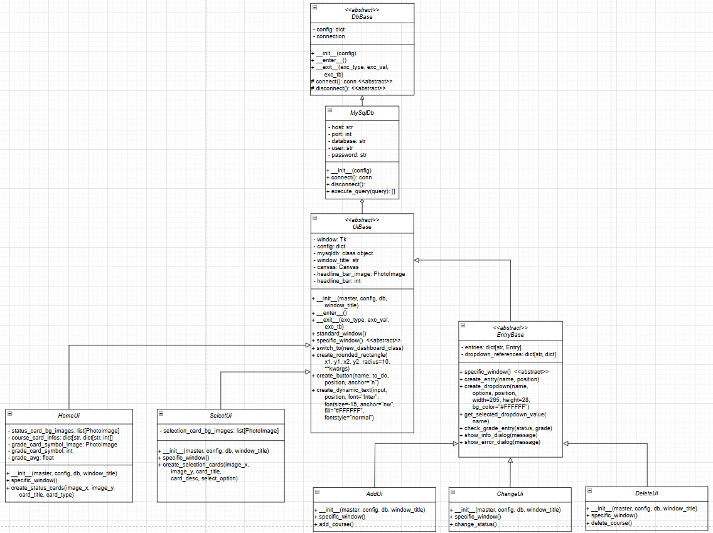
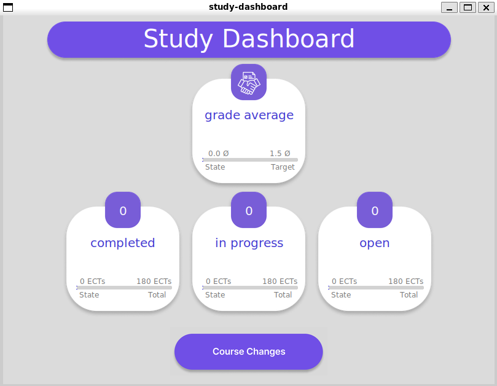
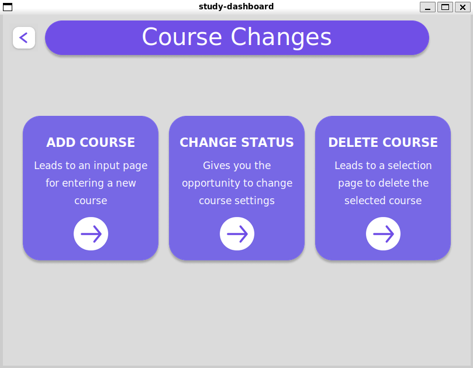
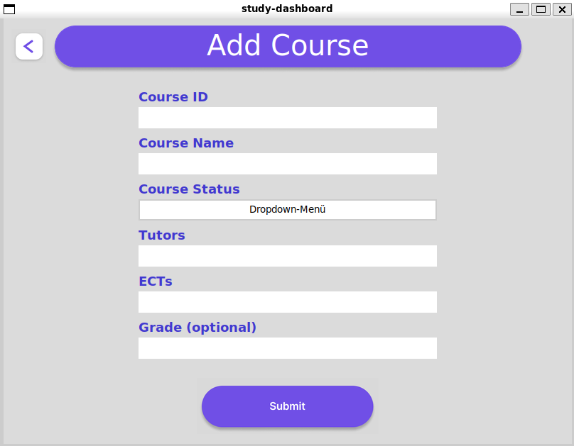
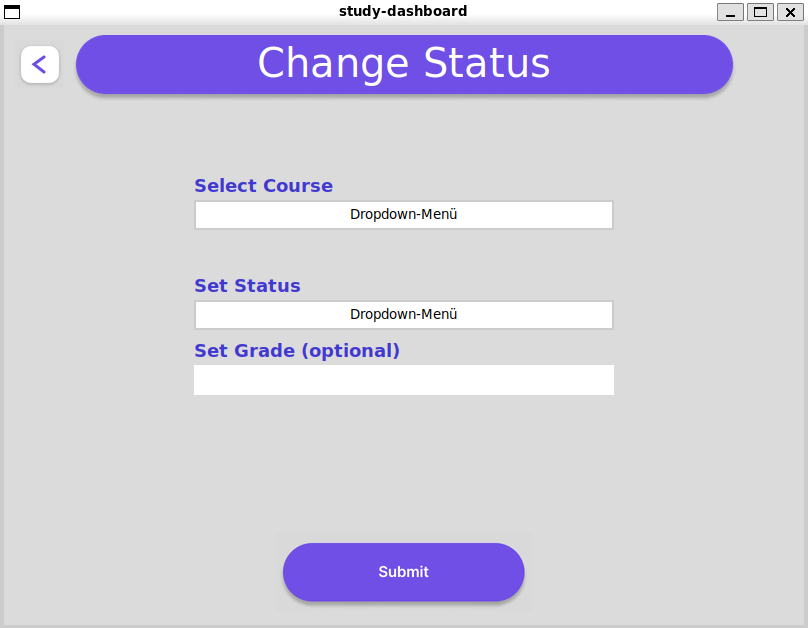
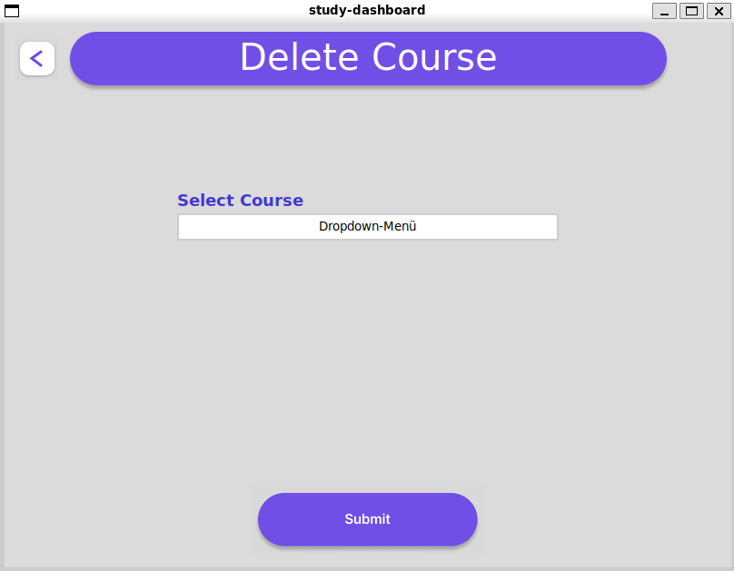
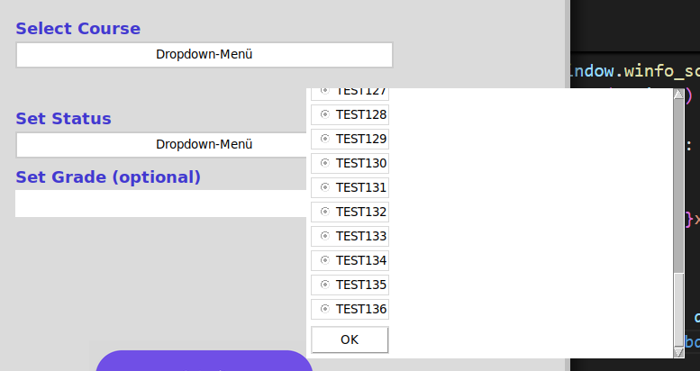
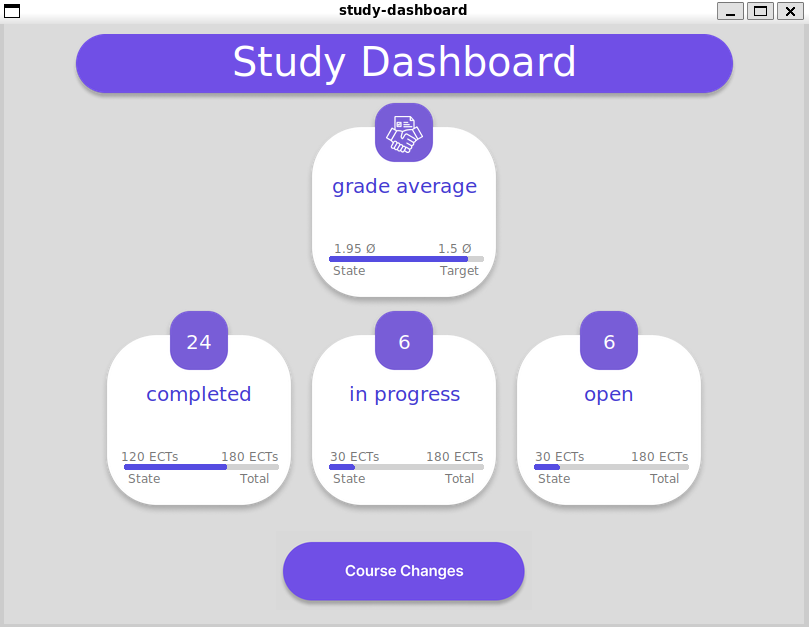

Study Dashboard
  

DLBDSOOFPP01_D - Objektorientierte und funktionale Programmierung mit Python
  

Portfolio - Erarbeitung
  

**Voraussetzungen erfüllen:**  
- Linux oder wsl einrichten  
- Abhängigkeiten über folgende Befehle installieren  
          - sudo apt update && sudo apt upgrade -y  
          - sudo apt install -y build-essential python3 python3-pip python3-venv git curl unzip  
          - sudo apt install -y docker.io docker-compose  

**Einrichtung mit make:**  
 - make prepare <deine-python-version> in der Konsole ausführen (Danach etwa 10-30 Sekunden warten)  
 - pyenv activate study-env   

**Ausführung des Projektes:**  
 - python main.py  

**Aufbau des Projektes:**  

  

**Nutzung des Projektes:**  
1. Ausführen der main.py  

  

2. Über den Course Changes Button zur Auswahlseite gelangen  

  

  

3. Über den mittleren Pfeil der Course Changes Seite zur Add Course Seite navigieren  

  

4. Über den mittleren Pfeil der Course Changes Seite zur Change Status Seite navigieren  

  

5. Über den rechten Pfeil der Course Changes Seite zur Delete Course Seite navigieren 

  

 

6. Dropdowns verwenden  

  

 

7. Eingabe-Ergebnisse auf der Startseite begutachten (Zurück über den Button oben links)

  

  

8. Gegebenfalls weitere Eingaben oder Änderungen über die gezeigten Möglichkeiten vornehmen
